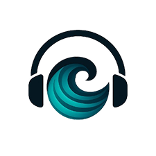

# 🌊 CalmWave - Aplicativo Android para Gravação e Melhoramento de Áudio

<div align="center">



**Grave, limpe e transcreva áudios diretamente no seu celular Android com interface simples e amigável**

[](https://www.android.com/)
[](https://kotlinlang.org/)
[](https://developer.android.com/jetpack/compose)
[](LICENSE.md)

</div>

---

## 📋 O que você encontrará neste documento

- [O que é o CalmWave](#-o-que-é-o-calmwave)
- [O que o aplicativo faz](#-o-que-o-aplicativo-faz)
- [Ferramentas e tecnologias usadas](#-ferramentas-e-tecnologias-usadas)
- [Requisitos para usar](#-requisitos-para-usar)
- [Como instalar](#-como-instalar)
- [Como configurar](#-como-configurar)
- [Como usar o aplicativo](#-como-usar-o-aplicativo)
- [Como o aplicativo funciona](#-como-o-aplicativo-funciona)
- [Mapa rápido de telas (dev)](#-mapa-rápido-de-telas-dev)
- [Onde encontrar mais informações](#-onde-encontrar-mais-informações)
- [Licença e Propriedade](#-licença-e-propriedade)
- [Agradecimentos](#-agradecimentos)

---

## 🎯 O que é o CalmWave

O **CalmWave** é um aplicativo para celulares Android criado pela **vvAi Startup** que permite:

- **Gravar áudios** com qualidade profissional
- **Limpar ruídos** dos áudios automaticamente (como barulho de fundo, ventilador, etc.)
- **Organizar** seus áudios em pastas personalizadas
- **Ouvir** os áudios com controles avançados

O aplicativo foi desenvolvido pensando em ser simples e fácil de usar, com uma interface colorida e agradável.

### ✨ Por que usar o CalmWave?

- 🎙️ **Gravação Crystal Clear** - Áudio limpo sem ruídos indesejados
- 🌐 **Offline First** - IA e espectrogramas gerados totalmente sem internet
- 📱 **Interface Amigável** - Fácil de usar para todas as idades
- 🔍 **Comparação Espectral** - Visualize com seus próprios olhos a potência da limpeza através de gráficos dinâmicos
- 🎵 **Controle Total** - Ajuste a velocidade de reprodução, pule trechos e mais
- 📂 **Organização Simples** - Crie pastas para organizar seus áudios
- ☁️ **Sincronia Silenciosa** - Usa offline? Sem problema, ele sincroniza progresso em background quando o Wifi conectar

---

## 🚀 O que o aplicativo faz

### 1. 🎙️ Gravar Áudio com Qualidade

O CalmWave permite que você grave áudios com qualidade profissional diretamente no seu celular:

- **Gravação de alta qualidade** - O áudio fica nítido e claro
- **Visualização em tempo real** - Veja as ondas sonoras enquanto grava
- **Pausar e continuar** - Pause a gravação quando precisar e retome depois
- **Contador de tempo** - Saiba exatamente quanto tempo você está gravando
- **Funciona com Bluetooth** - Use fones ou microfones Bluetooth
- **Processamento automático** - O áudio é limpo automaticamente enquanto você grava

### 2. 🌊 Limpar Ruídos do Áudio

Um dos grandes diferenciais do CalmWave é a limpeza automática de ruídos:

- **Remove barulho de fundo** - Elimina sons indesejados como ventilador, ar-condicionado, trânsito
- **Funciona durante a gravação** - Você já escuta o áudio limpo enquanto grava
- **Funciona sem internet** - Todo o processamento acontece no seu celular
- **Salva duas versões** - Guarda tanto o áudio original quanto o limpo
- **Resultado em tempo real** - Você pode ouvir o resultado imediatamente

### 3. 📝 Transformar Áudio em Texto

O aplicativo pode transcrever (escrever) o que foi falado no áudio:

- **Transcrição automática** - Usa inteligência artificial para converter fala em texto
- **Múltiplos idiomas** - Funciona com mais de 99 idiomas diferentes
- **Detecta o idioma sozinho** - Identifica automaticamente qual língua está sendo falada
- **Mostra o progresso** - Você acompanha quanto falta para terminar
- **Várias opções de qualidade** - Escolha entre velocidade ou precisão

### 4. 📂 Organizar seus Áudios

Mantenha tudo organizado de forma simples:

- **Crie pastas** - Organize seus áudios em categorias (ex: Trabalho, Família, Estudos)
- **Escolha cores** - Cada pasta pode ter uma cor diferente
- **Marque favoritos** - Destaque os áudios mais importantes
- **Busque facilmente** - Encontre rapidamente o áudio que precisa
- **Filtre por tipo** - Veja apenas originais ou apenas processados
- **Veja a data** - Saiba quando cada áudio foi criado

### 5. 🎵 Ouvir seus Áudios

Controle total na hora de ouvir:

- **Ajuste a velocidade** - Ouça mais rápido (até 1.5x) ou mais devagar (0.5x)
- **Navegue no áudio** - Pule para qualquer parte tocando na barra
- **Pule para o próximo/anterior** - Navegue entre seus áudios facilmente
- **Veja quanto falta** - Acompanhe o tempo total e quanto já ouviu
- **Interface bonita** - Controles grandes e fáceis de usar

### 6. 🎨 Interface Amigável

Tudo pensado para facilitar seu uso:

- **Design moderno** - Visual limpo e agradável
- **Animações suaves** - Transições bonitas entre telas
- **Cores alegres** - Interface colorida e convidativa
- **Fácil navegação** - Menu na parte de baixo da tela
- **Ícones claros** - Tudo identificado de forma visual

### 7. 🔍 Comparação Visual (Espectrogramas)

Veja com seus próprios olhos a diferença matemática que a limpeza de ruídos faz:

- **Visão Real das Frequências** - Espectrograma em tempo real de seus áudios
- **Comparação Lado a Lado** - Veja a renderização termal "antes/depois" do áudio processado
- **Cálculo Offline** - Processador digital de sinal (STFT) 100% nativo
- **Privacidade Total** - Nenhuma imagem ou áudio de comparação vai para a internet

---

## 🛠️ Ferramentas e tecnologias usadas

### Para quem quer saber o que tem "por trás"

O CalmWave foi construído usando tecnologias modernas e confiáveis. Aqui está uma explicação simples do que cada uma faz:

#### 📱 Plataforma e Linguagem
- **Android** - Sistema operacional dos celulares (versão 7.0 ou mais recente)
- **Kotlin** - Linguagem de programação moderna e segura, recomendada pelo Google para apps Android

#### 🎨 Interface Visual
- **Jetpack Compose** - Ferramenta para criar telas bonitas e interativas
- **Material Design 3** - Guia de design do Google para interfaces modernas e consistentes

#### 🔊 Áudio e Reprodução
- **ExoPlayer** - Sistema profissional de reprodução de áudio do Google
- **AudioTrack** - Tecnologia nativa do Android para tocar som em tempo real
- **WavRecorder** - Nosso próprio sistema de gravação em alta qualidade

#### 🤖 Inteligência Artificial e Processamento
- **ONNX Runtime** - Motor que executa a IA de limpeza de ruído no celular
- **UNet Denoiser** - Modelo de IA especializado em remover ruídos
- **STFT (Processador Matemático)** - Algoritmo local em Kotlin para transformar fatias de áudio em gráficos espectrais térmicos

#### 🌐 Comunicação e Background
- **OkHttp e WebSocket** - Sistema para comunicação pontual com servidores
- **WorkManager** - Orquestrador de threads invisíveis que lida com filas e envio das estatísticas offline

---

## 📦 Requisitos para usar

### O que você precisa

#### Para usar o aplicativo:
- **Um celular Android** funcionando com Android 7.0 ou mais novo (a maioria dos celulares atuais)
- **Permissões** que o app vai pedir:
  - Acesso ao **microfone** (para gravar)
  - Acesso ao **armazenamento** (para salvar os áudios)
  - Acesso à **internet** (apenas para transcrever - opcional)
  - Acesso ao **Bluetooth** (apenas se você usar fones Bluetooth - opcional)

#### Para desenvolvedores (programadores):
Se você é desenvolvedor e quer trabalhar no código do aplicativo, vai precisar de:
- **Android Studio** (programa para criar apps Android) versão Hedgehog ou mais recente
- **JDK 11** ou mais recente (Kit de ferramentas Java)
- **Git** (sistema de controle de versões)

---

## 💻 Como instalar

### Para desenvolvedores (se você vai mexer no código)

#### Passo 1: Baixar o código

No computador, abra o terminal e digite:

```bash
git clone https://github.com/vvAi-Startup/Application_mobile.git
cd Application_mobile
```

Isso vai baixar todos os arquivos do projeto para o seu computador.

#### Passo 2: Configurar o servidor (opcional)

Se você tiver um servidor próprio para transcrição, pode configurar aqui. Se não tiver, o aplicativo funciona normalmente sem isso:

```bash
export API_BASE_URL="http://seu-servidor:5000"
export WS_BASE_URL="ws://seu-servidor:5000"
```

Ou edite no arquivo de configuração em `app/build.gradle.kts`.

#### Passo 3: Abrir no Android Studio

1. Abra o **Android Studio**
2. Clique em **File > Open**
3. Selecione a pasta do projeto
4. Aguarde o Android Studio preparar tudo (pode demorar alguns minutos na primeira vez)

#### Passo 4: Instalar no celular

**Opção 1 - Pelo Android Studio:**
1. Conecte seu celular no computador via USB
2. Ative o "Modo Desenvolvedor" no celular
3. Clique no botão verde de "Play" no Android Studio

**Opção 2 - Pela linha de comando:**
```bash
./gradlew build
./gradlew installDebug
```

---

## ⚙️ Como configurar

### Configurações do servidor (apenas para desenvolvedores)

O aplicativo pode se conectar a um servidor para fazer a transcrição de áudios. Se você não tiver um servidor, não se preocupe - o aplicativo funciona normalmente sem ele!

**Endereço padrão do servidor:**
- Servidor principal: `http://10.67.57.104:5000`
- Para transcrição: `http://10.67.57.104:5000/api/v1/audio/transcricao`
- Para limpeza em tempo real: `ws://10.67.57.104:5000/api/v1/streaming/ws/audio-streaming`

**Como mudar o servidor:**

Se você tem seu próprio servidor, edite o arquivo `app/src/main/java/com/vvai/calmwave/Config.kt` e mude os endereços:

```kotlin
object Config {
    // Coloque o endereço do seu servidor aqui
    val apiBaseUrl: String get() = "http://seu-servidor:porta"
    val wsBaseUrl: String get() = "ws://seu-servidor:porta"
}
```

### Permissões que o aplicativo precisa

Quando você instalar o aplicativo, ele vai pedir algumas permissões. Aqui está o que cada uma faz:

- **🎙️ Microfone** - Para gravar os áudios
- **📁 Armazenamento** - Para salvar os áudios no celular
- **🌐 Internet** - Para enviar áudios para transcrição (apenas se você quiser usar essa função)
- **🎧 Bluetooth** - Para usar fones ou microfones Bluetooth (opcional)

Todas essas permissões são solicitadas automaticamente quando você abre o app pela primeira vez.

---

## 📱 Como usar o aplicativo

### Primeira vez que você abrir

1. Uma tela de abertura bonita vai aparecer (isso só acontece na primeira vez)
2. Depois, você vai direto para a tela de gravação

### Como gravar um áudio

1. **Toque no botão "Iniciar"** (é o grande no meio da tela)
2. **Fale no microfone** - Você verá ondas coloridas se mexendo conforme você fala
3. **Se precisar pausar**: Toque em "Pausar" e depois em "Continuar" quando quiser voltar
4. **Quando terminar**: Toque em "Encerrar"
5. **Pronto!** O aplicativo vai:
   - Limpar os ruídos automaticamente
   - Salvar o áudio original
   - Salvar o áudio limpo
   - Você pode ouvir os dois depois

### Como organizar seus áudios em pastas

1. Vá até a aba **"Pastas"** (na parte de baixo da tela)
2. Toque no botão **"+"** para criar uma nova pasta
3. Escolha um nome para a pasta (ex: "Reuniões", "Família", "Estudos")
4. Escolha uma cor para ela
5. Arraste seus áudios para as pastas

### Como ouvir um áudio

1. Vá na aba **"Áudios"**
2. Toque no áudio que quer ouvir
3. Uma tela com controles vai abrir:
   - **Botão Play/Pause** ▶️⏸️ - Para tocar ou pausar
   - **Barra de progresso** - Arraste para pular partes do áudio
   - **Velocidade** 🐌 🐰 - Toque para ouvir mais devagar ou mais rápido
   - **Setas** ⏮️ ⏭️ - Para ir para o áudio anterior ou próximo

### Como encontrar um áudio específico

1. Use a **caixinha de busca** no topo da tela
2. Digite o nome do áudio
3. Ou toque no **ícone de filtro** (três linhas) para:
   - Ver apenas seus favoritos ⭐
   - Ver apenas áudios de uma pasta específica
   - Ver apenas áudios originais ou limpos

---

## 🧠 Como o aplicativo funciona

### Uma explicação simples da estrutura

O CalmWave é organizado em "camadas", como um bolo de três andares. Cada camada tem sua função:

```
┌───────────────────┐
│  TELAS (o que     │  ← O que você vê e toca
│  você vê)         │     (botões, cores, animações)
└────────┬──────────┘
         │
         │
         ▼
┌────────┴──────────┐
│  LÓGICA           │  ← O "cérebro" que decide
│  (análise e       │     o que fazer quando você
│   decisões)       │     toca em algo
└────────┬──────────┘
         │
         │
         ▼
┌────────┴──────────┐
│  AÇÕES            │  ← Faz as coisas acontecerem
│  (gravar, tocar,  │     (acessa microfone, salva
│   salvar, limpar) │     arquivos, limpa ruído)
└───────────────────┘
```

### Como funciona quando você grava:

1. **Você toca em "Iniciar"** → A tela avisa a Lógica
2. **Lógica decide o que fazer** → Pede para começar a gravação
3. **Ações entram em jogo** → Liga o microfone e começa a gravar
4. **Enquanto você fala** → O áudio é limpo em tempo real
5. **Você toca em "Encerrar"** → Tudo é salvo no celular
6. **Tela é atualizada** → Mostra que terminou

### Componentes principais (peças do aplicativo):

- **Telas**:
  - Tela de Gravação - Onde você grava áudios
  - Tela de Pastas - Onde organiza seus áudios
  - Tela de Reprodução - Onde ouve os áudios
  - Tela de Sincronização - Gerenciamento transparente e diagnósticos de rede
  - Tela Comparativa Espectral - Observação clínica dos espectrogramas paralelos
  - Tela de Abertura - Primeira tela quando abre o app

- **Lógica Central (MainViewModel)**:
  - Gerencia tudo que acontece no app
  - Guarda informações (quais áudios existem, qual está tocando, etc.)
  - Coordena as ações

- **Sistemas de Ação**:
  - **AudioService** - Cuida de tocar áudios localmente e streaming
  - **WavRecorder** - Responsável por captar blocos de 16-bits
  - **LocalAudioDenoiser** - Faz a dedução anti-ruído no processador (ONNX)
  - **SpectrogramGenerator** - Fornece arrays e Bitmaps de Fourier
  - **SyncAnalyticsWorker** - Agenda os envios de estatística quando conveniente

---

---

## 🧭 Mapa rápido de telas (dev)

Para facilitar manutenção e mudanças pontuais em UI/fluxo:

- **Splash / entrada**: `app/src/main/java/com/vvai/calmwave/SplashActivity.kt`
- **Tela principal (Início)**: `app/src/main/java/com/vvai/calmwave/MainActivity.kt`
- **Tela de gravação**: `app/src/main/java/com/vvai/calmwave/GravarActivity.kt`
- **Tela de playlists/áudios**: `app/src/main/java/com/vvai/calmwave/PlaylistActivity.kt`
- **Tela utilitária de player/diagnóstico**: `app/src/main/java/com/vvai/calmwave/MainActivity.kt`
- **Tela de comparação espectral**: `app/src/main/java/com/vvai/calmwave/SpectrogramComparisonActivity.kt`
- **Tela de status e background sync**: `app/src/main/java/com/vvai/calmwave/SyncStatusActivity.kt`

Camadas de suporte principais:

- **Estado e regras da gravação/processamento**: `app/src/main/java/com/vvai/calmwave/MainViewModel.kt`
- **Gravação WAV por chunks**: `app/src/main/java/com/vvai/calmwave/WavRecorder.kt`
- **Processamento local offline (denoise)**: `app/src/main/java/com/vvai/calmwave/LocalAudioDenoiser.kt`
- **Reprodução/streaming local de áudio**: `app/src/main/java/com/vvai/calmwave/AudioService.kt`
- **Cache local + sync quando online**: `app/src/main/java/com/vvai/calmwave/data/repository/AnalyticsRepository.kt`
- **Sincronização em background (WorkManager)**: `app/src/main/java/com/vvai/calmwave/workers/SyncAnalyticsWorker.kt`

> Regra de arquitetura mantida: gravação/processamento continuam funcionando offline em tempo real, com cache local e sincronização para API quando houver conectividade.

---

## 📚 Onde encontrar mais informações

### Documentos disponíveis

Se você quiser entender mais sobre como o CalmWave funciona, temos vários documentos:

- **[fluxo_gravacao_audio.md](fluxo_gravacao_audio.md)** 
  - Detalha a arquitetura e ciclo de vida do áudio no aplicativo
  - Explica o fluxo desde o microfone até a sincronização final com a API

- **[funcionamento_onnx_denoiser.md](funcionamento_onnx_denoiser.md)** 
  - Como funciona o sistema de inteligência artificial local
  - Detalha a arquitetura do modelo ONNX e processamento offline

- **[espectrograma_offline.md](espectrograma_offline.md)** 
  - Visão geral da engenharia em Kotlin para renderizar Espectrogramas Reais off-device (FFT/STFT)

### Versão Atual: 1.0.0 ✅

O que já funciona agora:
- ✅ Gravar áudios com qualidade
- ✅ Limpar ruídos automaticamente na Nuvem ou via Processador Neural Próprio
- ✅ Mapear Pastas (Playlists independentes via Room/Prefs)
- ✅ Visualização Espectral Offline Completa (Fast Fourier Transform)
- ✅ Mecanismo WorkManager em 2º plano para dados offline
- ✅ Ouvir com waveforms animadas
- ✅ Interface bonita e acessível


### ⚠️ Aviso Importante

Este projeto pertence exclusivamente à **vvAi Startup**. Pessoas de fora da empresa não podem contribuir no momento.

### Se você faz parte da equipe vvAi

Se você trabalha na vvAi e vai mexer no código, siga estas regras:

1. **NUNCA** adicione código direto na branch principal (`main`)
2. **Sempre crie uma branch** (ramificação) separada para cada nova funcionalidade:
   ```bash
   git checkout -b feature/nome-da-sua-funcionalidade
   ```
   
3. **Salve suas mudanças** com mensagens claras:
   ```bash
   git commit -m "feat: adiciona função de [descreva o que foi feito]"
   ```
   
4. **Envie para o repositório**:
   ```bash
   git push origin feature/nome-da-sua-funcionalidade
   ```
   
5. **Peça revisão** - Abra um Pull Request para que outros membros da equipe revisem seu código

### Padrões de código

Para manter o código limpo e organizado:

- Escreva nomes de variáveis e funções em português
- Use nomes que explicam o que fazem (ex: `gravarAudio`, `limparRuido`)
- Adicione comentários explicando partes mais complexas
- Faça commits pequenos e específicos (uma mudança de cada vez)

---

## 📄 Licença e Propriedade

### Copyright © 2025 vvAi Startup

**Este projeto é propriedade privada da vvAi Startup.**

### O que isso significa?

Significa que SOMENTE a vvAi Startup tem direitos sobre este aplicativo. 

**Você NÃO PODE**:
- ❌ Usar este código fora da vvAi Startup
- ❌ Copiar o código para usar em outros projetos
- ❌ Modificar e distribuir
- ❌ Criar versões derivadas
- ❌ Usar para ganhar dinheiro fora da empresa
- ❌ Tentar descobrir como funciona para copiar (engenharia reversa)

**Você PODE** (se for da equipe):
- ✅ Trabalhar no código se você for membro autorizado da equipe vvAi Startup

Para mais detalhes legais, veja o arquivo [LICENSE.md](LICENSE.md).

---


## 🙏 Agradecimentos

Feito com muito ❤️ e dedicação pela equipe **vvAi Startup**

### Nossa Equipe

Desenvolvido pela talentosa equipe vvAi Startup, que trabalhou duro para criar um aplicativo útil e fácil de usar.

### Ferramentas que Utilizamos

Agradecemos às tecnologias de código aberto (gratuitas e criadas por comunidades) que nos ajudaram a construir o CalmWave:

- **[Kotlin](https://kotlinlang.org/)** - A linguagem de programação que usamos
- **[Android](https://www.android.com/)** - Sistema operacional do Google
- **[Jetpack Compose](https://developer.android.com/jetpack/compose)** - Ferramenta do Google para criar telas bonitas
- **[ExoPlayer](https://exoplayer.dev/)** - Sistema de reprodução de áudio do Google
- **[OkHttp](https://square.github.io/okhttp/)** - Sistema para comunicação com servidores
- **[OpenAI Whisper](https://github.com/openai/whisper)** - Inteligência artificial para transcrição

---

<div align="center">

**CalmWave** - Transformando áudio em experiência

Versão 1.0.0 | © 2025 vvAi Startup | Todos os direitos reservados

</div>
