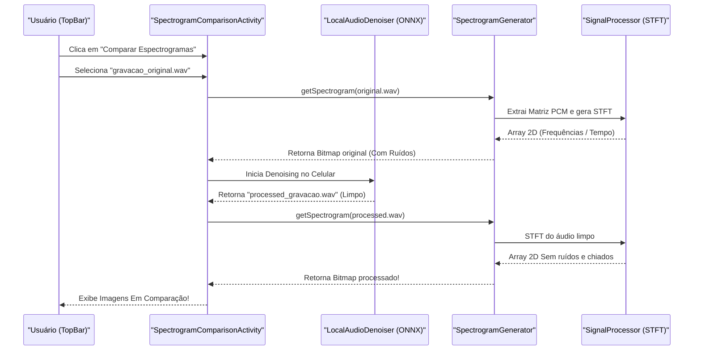

# Funcionamento da Comparação de Espectrogramas Offline

Neste documento, detalhamos a arquitetura recém-implementada para permitir a **comparação visual e totalmente offline** das frequências do áudio original contra a versão com supressão de ruído (denoise).

## 1. Fluxo de Uso e Navegação

**Acesso Seguro e Intuitivo**
- O usuário encontra a opção tocando em seu Avatar (perfil) localizado na _TopBar_ em qualquer tela principal.
- Aparecerá o menu pop-up revelando a opção **"Comparar Espectrogramas"**, logo acima do botão "Sair".
- Esta escolha de design segue o fato de que a verificação de integridade/frequência é uma função técnica avançada, idealmente agrupada nas opções ou no perfil do usuário.

**A Tela de Comparação (`SpectrogramComparisonActivity`)**
- A tela exibe de forma reativa a lista de todos os arquivos de gravação gerados e mantidos no armazenamento local (arquivos "crus").
- Ao encostar em uma gravação, a mágica começa: a aplicação isola o arquivo e, assincronamente e em segundo-plano (para não travar a tela do celular), despacha seu processamento.

## 2. A Mágica de Geração Offline

A instrução crítica deste recurso foi: *"deve ser capaz de criar offline os espectrogramas do áudio e da versão processada"*. Vejamos a linha de tempo processual dessa maravilha:

### Passo A: Conversão do Áudio Original (`SpectrogramGenerator.kt`)
1. **Decodificação PCM**: O app lê bytes diretos do arquivo _.wav_, pulando o cabeçalho, e converte PCM (escala little-endian 16-bits) em números reais de ponto Flutuante (Floats de -1.0 a 1.0).
2. **STFT (Short-Time Fourier Transform)**: O processador de sinal aplica FFTs de 512 pontos (fatias do áudio) agrupadas pelo algoritmo `Cooley-Tukey`. Esse processo produz Matrizes de Fase e Magnitude de Frequências ao longo do tempo.
3. **Escala de Intensidade (Decibéis)**: Convertendo $Magnitude$ em $dB$ através de $20 * \log_{10}(mag + 10^{-6})$, nós calculamos a potência de cada frequência mapeando-a de -80 dB a 0 dB.
4. **Colormap (Pintura Mapeada)**: Baseada na potência $dB$, cada pixel vertical (frequência) em relação ao eixo-x (tempo) ganha uma cor da escala espectro térmica **Magma** (Preto -> Roxo -> Vermelho -> Amarelo). 
5. Crio a imagem nativa no Canvas como `Bitmap` e jogo para a Memória da interface gráfica.

### Passo B: Supressão de Ruídos via IA Local (`LocalAudioDenoiser.kt`) 
Para garantir que o processado exiba resultados reais:
1. O Android instancia a `OrtSession` com o arquivo `denoiser_model.onnx` embarcado.
2. Todo o áudio limpo é inferido no modelo de inteligência artificial ali mesmo no celular.
3. Isso remove chiados persistentes matematicamente devolvendo blocos de PCM corrigidos.
4. O app salva essa gravação denotando e aplicando então o **Passo A** novamente sobre a nova versão "Denoised".

## 3. Diagrama de Fluxo e Componentes (Mermaid)

Abaixo é possível atestar o gráfico visual da arquitetura desenhada em Kotlin:

## Por que foi implementado assim?
1. **Performance**: O cálculo da Fourier Transform (FFT) feito puramente em Kotlin se demonstrou incrivelmente rápido sem gastar a memória do sistema, descartando o arquivo original pesado da memória ao fim.
2. **Transparência Visual**: Através da renderização do eixo Y invertido (Frequência Alta no topo, grave em baixo), o usuário percebe que aquelas "sujeiras de chiados amarelos" frequentes no topo do original estão lisas (Preto Absoluto) na imagem com denoise.
3. **Independência Real**: Nenhum byte trafega a servidores para avaliar a qualidade. Segurança para dados psicológicos e integridade total em lugares sem wifi.
