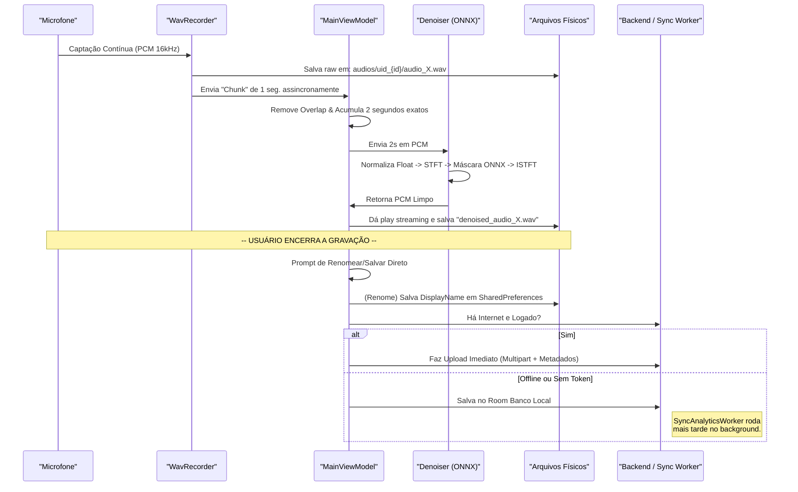

# Fluxo de Gravação, Processamento e Sincronização de Áudio

Este documento detalha a arquitetura e ciclo de vida do áudio no aplicativo CalmWave, desde o momento em que a voz do usuário entra pelo microfone até a sincronização final com a API. Abordamos também as lógicas de isolamento por "token de usuário" (pastas) e as estratégias de renomeação customizada.

---

## Diagrama Geral do Fluxo

O processo flui do microfone ao backend, com pesados desvios arquiteturais para suportar IA offline em tempo real e reconectividade falha (Offline-First). 

---

## 1. Captura de Áudio e Isolamento por Usuário
**Arquivos Principais:** `WavRecorder.kt` e `UserScopedStorage.kt`

Quando o usuário toca no botão de "Iniciar", a captação de áudio é ativada em **background**.
- O Android capta o som do microfone no formato raw (pcm) mono, 16.000Hz, 16-bits.
- **Salvamento com Token/Isolamento de Diretório:** O aplicativo nunca mistura áudios de diferentes perfis na mesma pasta raiz. O utilitário `getUserScopedKey()` injeta um subdiretório baseado no login atual utilizando as chaves seguras (SharedPreferences protegidas).
    - Ex: Se o usuário estiver usando Token da Nuvem e o ID dele na nuvem for `45`: A gravação irá cair diretamente dentro da pasta física protegida `/audios/uid_45/`.
    - Ex: Se estiver sem ID ou como guest (visitante convidado): A pasta será `/audios/guest/` ou `audios/email_xxx/`.
- Ao mesmo tempo em que a gravação bruta preenche o WAV, blocos temporários de cerca de **1 segundo** (+45ms de "Overlap") saltam de forma fluída como eventos de streaming nativo.

## 2. Enfileiramento em Tempo Real
**Arquivo Principal:** `MainViewModel.kt`

- Existe um "Canal" (*Channel* Kotlin não-bloqueante) pronto para não deixar as informações represarem e quebrarem o microfone.
- Uma rotina (*coroutine*) dedicada recolhe os pedaços que vêm do `WavRecorder`, limpa as sobreposições de borda entre os pedaços e consolida uma mala de amostras até o pacote atingir um limite perfeito: **2 Segundos Exatos de Áudio** (32.000 amostras).

## 3. Limpeza com Inteligência Artificial Local (ONNX)
**Arquivos Principais:** `LocalAudioDenoiser.kt` e `SignalProcessor.kt`

Este segmento funciona inteiramente Offline no chip do usuário, sem mandar voz crua pra internet.
1. **Transformação PCM para Float:** Passa o arquivo bruto numa escala `[-1.0 a 1.0]`.
2. **Espectrograma (STFT):** Gera as dimensões de tempo, frequência e fase da voz numa grade matemática.
3. **Máscara da IA:** O modelo embutido `.onnx` baseado em arquitetura UNet recebe a grade e detecta com altíssima taxa o padrão de voz vs frequências distorcidas. O ONNX cospe uma "Máscara" contendo os volumes do que ele crê ser "Sujeira".
4. **Aplicação & Reconstrução (ISTFT):** A máscara silencia as distorções, preservando a voz humana e um processo reverso transforma esse "gráfico limpo" de volta em som físico PCM.

## 4. Retorno ao Usuário (Playback Streaming)
**Arquivo Principal:** `AudioService.kt`

Imediatamente após a IA processar os 2 segundos isolados:
- O celular injeta a versão purificada via `AudioTrack` nos falantes. O usuário escuta a própria voz processada poucos segundos após tê-la falido em formato tempo real continuado.
- Os 2 segundos de áudios brancos caem todos enfileirados num arquivo novo (e também isolado com a tag do usuário), nomeado automaticamente para `denoised_TIMESTAMP.wav`.

## 5. Fechamento de Gravação e Função de Mudar Nome (Rename)
Quando a pessoa clica em **"Encerrar"**:
1. Ambos os arquivos `WAV` (original cru e o limpo limpo `denoised`) encerram e escrevem seu final no cabeçalho RIFF atualizando o peso final nos registros.
2. A interface de tela abre o Menu perguntando: `"Deseja Salvar Direto ou Renomear?"` 
3. **Como é Mudado o Nome:**
   - Para economia de energia do celular o CalmWave **NÃO ENTRA no sistema operacional Android** para tentar renomear o arquivo puramente digital (Mover Arquivos `.wav`). Isso poderia esbarrar em travas de permissão pesadas no Android 11+.
   - Ele utiliza um banco Map no arquivo de perfil restrito (via `SharedPreferences`), uma matriz chamada `audioDisplayNames`.
   - Se o áudio nasceu como `denoised_audio_171569420.wav`, o código em `GravarActivity` salva uma ponte do caminho absoluto desse diretório amarrando-o ao nome customizado como `"Minha Gravação Legal"`. Ao abrir a tela de Listar Playlists, o aplicativo varre a matriz e exibe os novos "Apelidos"; enganando aos olhos do usuário de que o documento mudou de fato de formato/arquivo no celular.

## 6. Sincronização Inteligente e Assíncrona (API Sync)
**Arquivos Principais:** `AnalyticsRepository.kt` e `SyncAnalyticsWorker.kt`

O usuário bate o martelo ao aprovar a gravação. O módulo agrupa o arquivo WAV limpo (via URI) mais alguns cálculos estatísticos como duração, métricas de sucesso de remoção da IA, dispositivo nativo, etc.
- **Checagem de Qualidade e Conexão:**
    - Se a pessoa **tem Internet e está logada com Token ativo** no cabeçalho Web, envia o arquivo recém-gravado via `MultipartBody` diretamente para a Nuvem em `/api/audios/sync`.
- **Offline-First (Trabalhando em Aviões/Estações Sem Sinal):**
    - Desconectado? Perfil não sincronizado? Sem pânico. Os arquivos WAV estão salvos no compartimento isolado (Passo 1). E a métrica vai parar num Banco de Dados SQL interno (*Room Database*).
    - O Android agendou passivamente no fundo do telefone um processo batizado de `SyncAnalyticsWorker`. Assincronamente, durante a viagem ou sono do usuário conectado finalmente numa wi-fi, este operário sem rosto sobe discretamente todo repositório para manter a métrica perfeita das horas treinadas e fonoaudiológicas da nuvem CalmWave.
